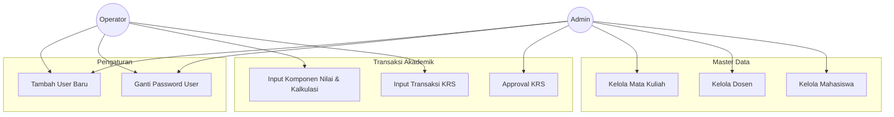
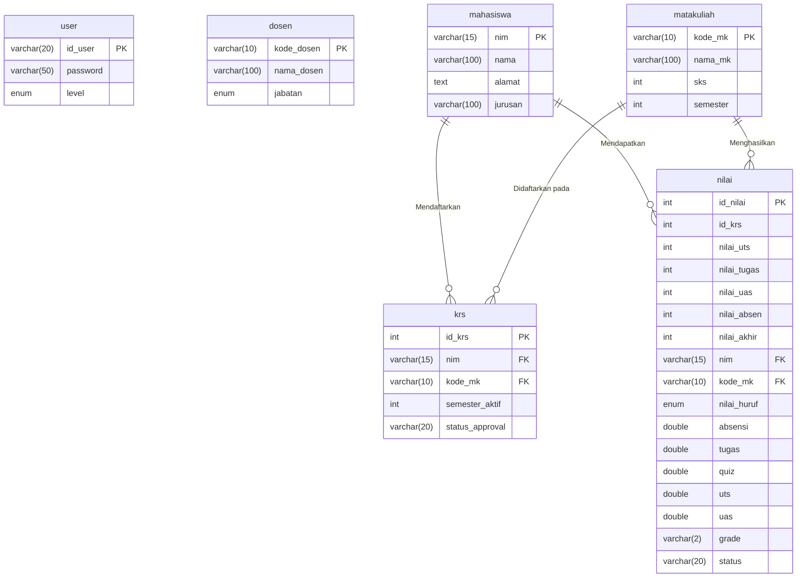
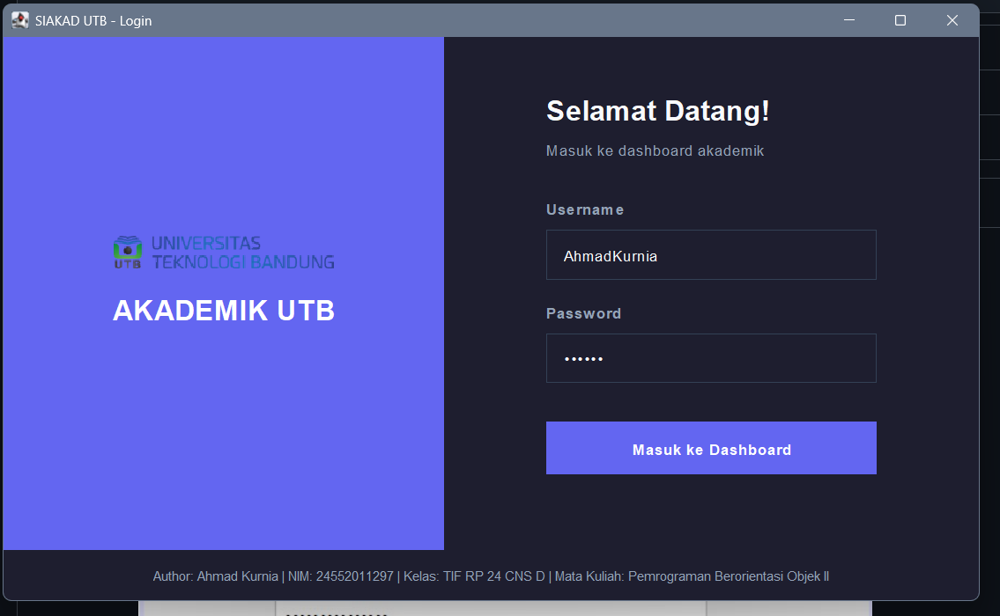
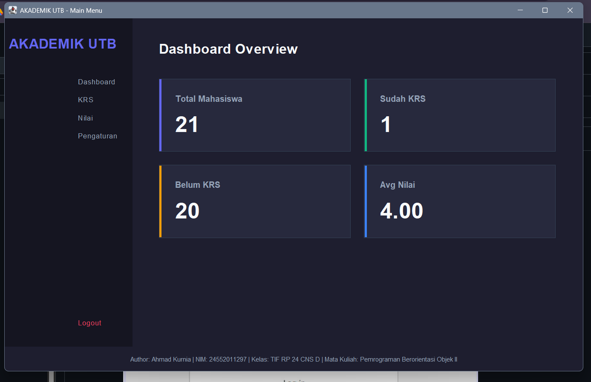
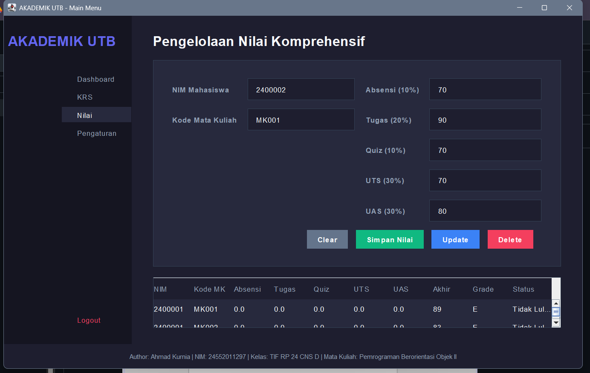
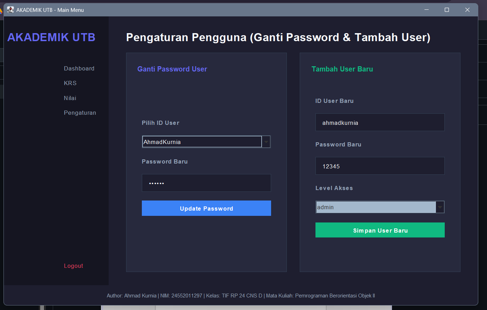

# 🎓 Sistem Akademik UTB (SIAKAD)

Sistem Informasi Akademik Universitas Teknologi Bandung (SIAKAD UTB) adalah aplikasi desktop berbasis Java GUI (Swing) yang dirancang untuk mengelola data akademik secara komprehensif. Aplikasi ini dilengkapi dengan arsitektur **Multi-Role (Admin & Operator)**, antarmuka modern yang seamless (dark-mode), serta kalkulasi nilai otomatis.

---

## 📑 Daftar Isi
1. [Fitur Utama](#-fitur-utama)
2. [Stack Teknologi](#-stack-teknologi)
3. [Struktur Folder Project](#-struktur-folder-project)
4. [Tugas & Hak Akses Role](#-tugas--hak-akses-role)
5. [Cara Menggunakan](#-cara-menggunakan)
6. [Panduan Penggunaan Lengkap](#-panduan-penggunaan-lengkap)
7. [Use Case & Alur Kerja (Visual)](#-use-case--alur-kerja-visual)
8. [Skema Visual Database](#-skema-visual-database)
9. [Screenshot Aplikasi](#-screenshot-aplikasi)

---

## 🌟 Fitur Utama
- **Multi-Role Authentication**: Login aman dengan pemisahan hak akses ketat antara *Admin* dan *Operator*.
- **Master Data Management**: Modul CRUD (Create, Read, Update, Delete) lengkap untuk Mahasiswa, Dosen, dan Mata Kuliah.
- **Transaksi KRS & Approval**: Pendaftaran KRS oleh mahasiswa yang dikelola oleh Operator, dengan validasi/Approval oleh Admin (Dosen Wali).
- **Pengelolaan Nilai Komprehensif**: Kalkulasi otomatis *Nilai Akhir*, *Grade* (A/B/C/D/E), dan *Status Kelulusan* berdasarkan bobot Absensi, Tugas, Quiz, UTS, dan UAS.
- **Dynamic User Settings**: Fitur untuk menambah user baru dan mengganti password secara fleksibel (Target ID User).
- **Modern UI/UX**: Desain flat, borderless, dan dark-mode menggunakan kustomisasi komponen Swing secara penuh.

---

## 🛠️ Stack Teknologi
- **Bahasa Pemrograman**: Java (JDK 8 / 11+)
- **GUI Framework**: Java Swing & AWT (CardLayout, GridBagLayout, flat styling)
- **Database**: MySQL (XAMPP / MariaDB)
- **Driver**: JDBC MySQL Connector (`mysql-connector-java`)
- **IDE**: Apache NetBeans

---

## 📁 Struktur Folder Project
```text
SistemAkademikUTB/
│
├── src/
│   ├── Akademik/
│   │   ├── Koneksi.java                # Konfigurasi & Driver Database
│   │   ├── Session.java                # Manajemen state Session/Login
│   │   ├── StyleManager.java           # Centralized UI/UX Styling (Dark Theme)
│   │   ├── SistemAkademikUTB.java      # Main class / Entry Point
│   │   ├── FormLogin.java              # Halaman Login
│   │   ├── MenuUtama.java              # Dashboard & Navigasi Sidebar (CardLayout)
│   │   ├── FormMahasiswa.java          # Modul Data Mahasiswa
│   │   ├── FormDosen.java              # Modul Data Dosen
│   │   ├── FormMatakuliah.java         # Modul Data Mata Kuliah
│   │   ├── FormDataUser.java           # Modul Data User (Admin)
│   │   ├── FormKrs.java                # Modul Input KRS
│   │   ├── FormApprovalKrs.java        # Modul Persetujuan KRS (Admin)
│   │   ├── FormNilai.java              # Modul Perhitungan Nilai Lengkap
│   │   └── FormPengaturanPengguna.java # Modul Ganti Password & Tambah User
│   │
│   └── img/                            # Aset gambar & Logo
│
└── lib/                                # Library Eksternal (JDBC Driver)
```

---

## 🔐 Tugas & Hak Akses Role

| Role | Menu yang Bisa Diakses | Tugas Utama |
|---|---|---|
| **Admin** | Dashboard, Mahasiswa, Dosen, Mata Kuliah, Pengaturan | Monitoring data akademik, kelola master data (mahasiswa, dosen, mata kuliah), approval KRS, kelola pengaturan akun. |
| **Operator**| Dashboard, KRS, Nilai, Pengaturan | Input dan update transaksi KRS, input komponen nilai sampai nilai akhir, maintenance akun. |

---

## 🚀 Cara Menggunakan
1. **Siapkan Database**:
   - Jalankan **XAMPP** (Start *Apache* dan *MySQL*).
   - Buat database baru bernama `db_uts_pbo_ahmad` di phpMyAdmin.
   - Aplikasi akan otomatis menyesuaikan beberapa skema tabel menggunakan DDL Scripting saat modul FormNilai atau FormApprovalKrs pertama dijalankan.
2. **Setup Project**:
   - Buka project di **Apache NetBeans**.
   - Pastikan Library `mysql-connector-j` telah ditambahkan di bagian *Libraries*.
3. **Run Aplikasi**:
   - Jalankan `SistemAkademikUTB.java` atau `FormLogin.java`.
   - Gunakan akun dengan level `admin` atau `operator` untuk mengeksplorasi pembatasan akses.

---

## 📖 Panduan Penggunaan Lengkap
- **Login**: Masukkan ID User dan Password. Sistem akan mendeteksi secara otomatis apakah Anda *Admin* atau *Operator*.
- **Master Data**: Klik menu di Sidebar (cth: Mahasiswa). Isi form di bagian atas, lalu tekan **Create**. Data akan langsung muncul di *JTable* bagian bawah. Klik baris pada tabel untuk mengisi form secara otomatis, lalu tekan **Update** atau **Delete**.
- **KRS & Approval**: Operator memasukkan NIM dan Kode MK di menu KRS. Admin melihat daftarnya di menu *Approval KRS* dan menentukan untuk menyetujui atau menolak pengajuan tersebut secara sistem.
- **Pengelolaan Nilai**: Operator masuk ke menu Nilai. Masukkan NIM, Kode MK, dan nilai per komponen (Absensi, Tugas, Quiz, dll). Klik *Simpan Nilai* dan sistem akan menghitung nilai akhir, menentukan grade, dan menetapkan status kelulusan secara otomatis!
- **Pengaturan Pengguna**: Pilih ID User dari dropdown, masukkan password baru, lalu klik *Update Password*. Anda juga dapat membuat User Baru dengan menetapkan *Level Akses*.

---

## 🔄 Use Case & Alur Kerja (Visual)



---

## 🗄️ Skema Visual Database



---

## 📸 Screenshot Aplikasi

> *Panduan: Ganti path gambar di bawah dengan screenshot asli setelah aplikasi dijalankan (simpan di folder `img/`).*

### 1. Halaman Login


### 2. Dashboard & Sidebar Navigasi


### 3. Modul Pengelolaan Nilai (Kalkulasi Otomatis)


### 4. Pengaturan Pengguna


IDENTITAS PENGEMBANG (AUTHOR)
Nama Mahasiswa           : Ahmad Kurnia
NIM                      : 24552011297
Mata Kuliah              : Pemrograman Berorientasi Objek II
Program Studi            : Teknik Informatika
Universitas Teknologi Bandung (UTB)
Dosen Pengampu : Bapak Iwan Ridwan, S.T., M.Kom.

---
*Dibuat untuk Project Sistem Akademik Universitas Teknologi Bandung (UTB).*
